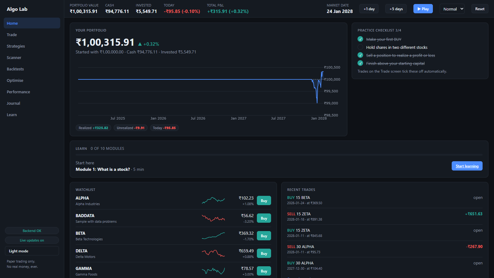
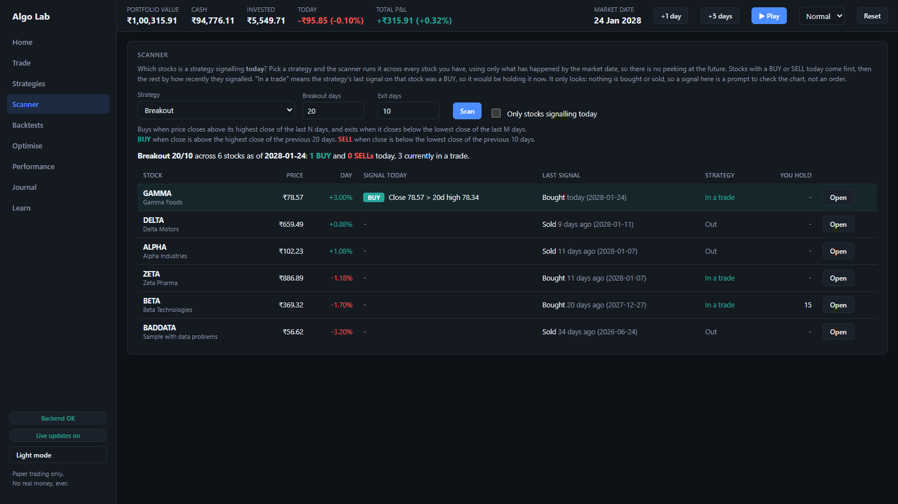
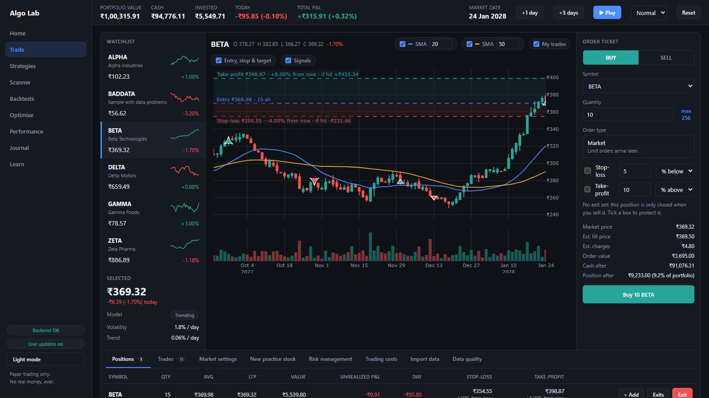
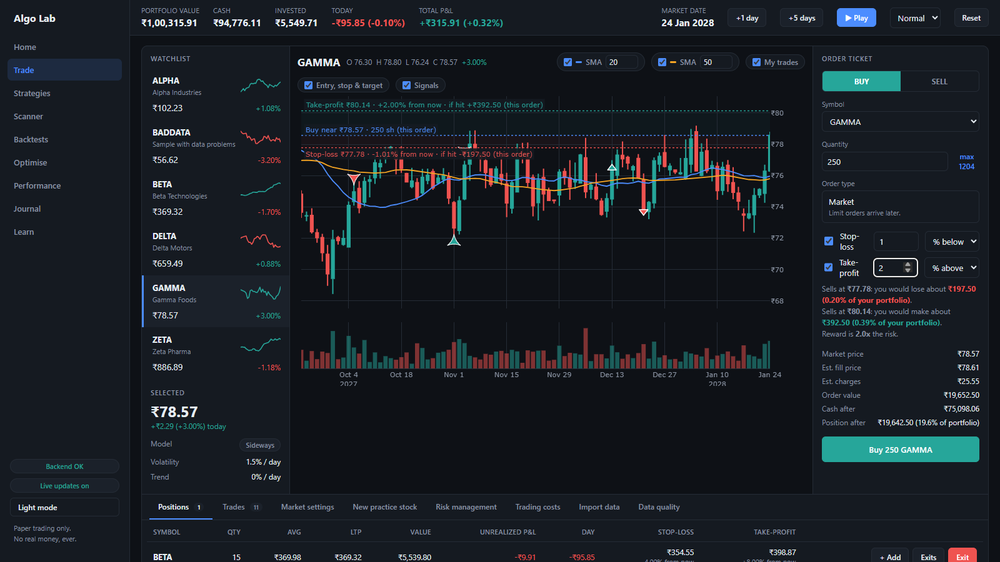
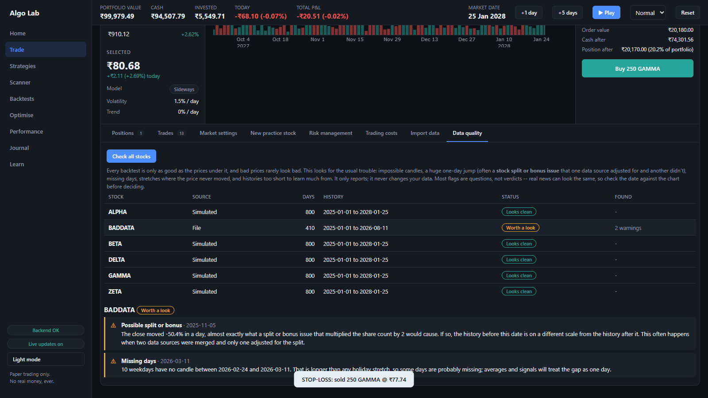
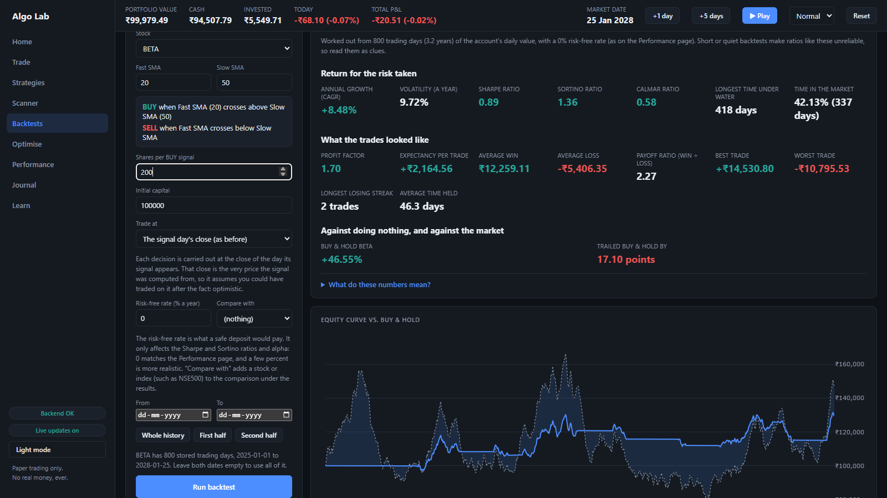
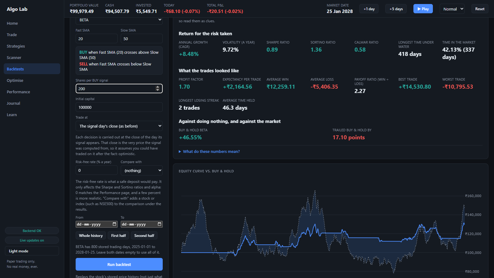
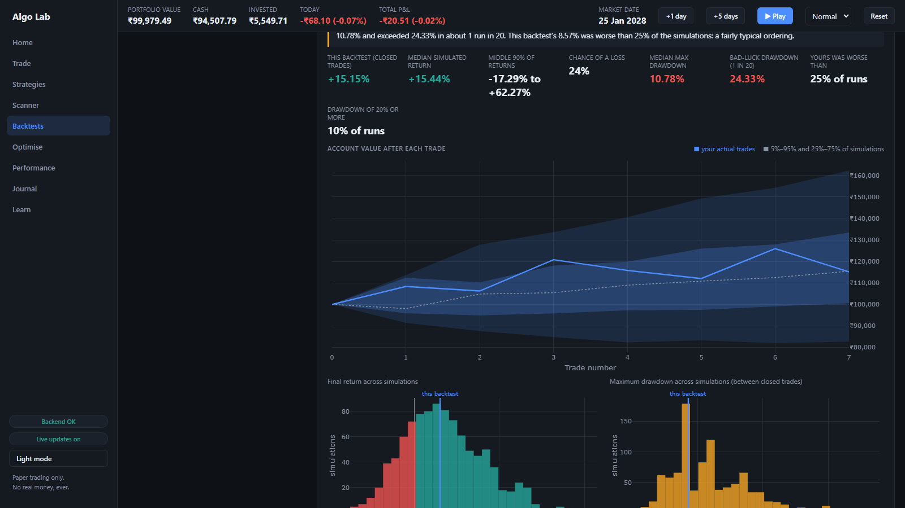
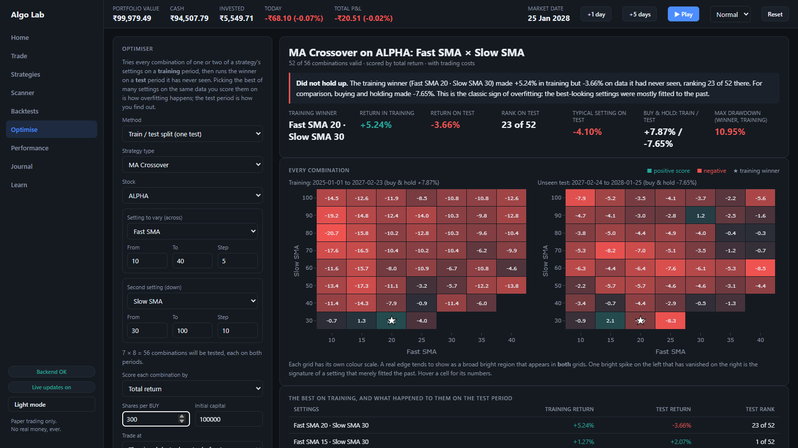

# Algo Trading Learning Lab

Educational algorithmic trading simulator. Paper-trading only — no real
money, no live orders. See
[algo_trading_learning_lab_project_plan.md](docs/algo_trading_learning_lab_project_plan.md)
for the full phase-by-phase plan.

## Download for Windows

**[Download the latest release](https://github.com/sandeepamrutia0604-cmd/algo-trading-learning-lab/releases/latest)**
(about 22 MB), or see the [website](https://sandeepamrutia0604-cmd.github.io/algo-trading-learning-lab/).
It needs no Python, no account and no API keys: it comes with simulated stocks, and you can import price files
(CSV) you downloaded yourself.

1. Right-click the zip and choose **Extract All** (don't run it from inside the zip).
2. Open the folder and double-click `AlgoTradingLab.exe`. A console window opens and so does your browser.
   Leave the console window open while you use the app; close it to quit.
3. If Windows says "Windows protected your PC", that is SmartScreen warning about a program that isn't signed with
   a paid certificate. Click **More info**, then **Run anyway**. To check your download, compare
   `Get-FileHash .\AlgoTradingLab-*-windows.zip -Algorithm SHA256` with the `SHA256.txt` on the release page.

Your portfolio and history live in `%LOCALAPPDATA%\AlgoTradingLab`, not in the app folder, so updating or deleting the
app never touches them. To remove everything, delete the unzipped folder and that data folder. In this build no broker
is ever contacted, no `.env` is read, and the Upstox and Angel One import is switched off; a new database starts with
about three years of simulated history so backtests have something to work with. To run it from the source instead
(and to use the broker import with your own keys), see [Setup](#setup) below. How the download is built is in
[docs/DEMO.md](docs/DEMO.md#9-building-the-windows-download).

## Tour

**Watch the 4-minute video tour: https://youtu.be/XV_4WqOabwU**

A practice lab for algorithmic trading, using paper money only. You pick or write a rule for when to buy and
sell, test it on history, and the app works hard to show you whether the result was skill or luck, because most
beginners' backtests are luck. Everything below is the real app, running on its built-in demo data (simulated
stocks, so no broker account or market data licence is needed). To run it yourself:
`python scripts/demo_setup.py`, then `scripts\start_demo.bat`. The guide to showing it, with a live-demo script and
how the video and these screenshots are made, is [docs/DEMO.md](docs/DEMO.md).

**Home**: a paper portfolio, a practice checklist, and a guided ten-part course.



**Scanner**: which stocks is a strategy signalling today? It only uses what has happened by the market date, so
there is no peeking at the future.



**Trade**: a position's entry, stop-loss and take-profit are drawn on the chart, with the zones between them
tinted red (what you could lose) and green (what you could make).



**Order ticket**: set a stop-loss and a take-profit and the chart previews them before you buy, with the money at
risk, the reward, and the reward-to-risk ratio. The market then moves one day at a time and each day's low and high
are checked against your levels.



**Data quality**: bad prices rarely look bad. This check found a half-price day that looks like an unadjusted
stock split, and ten missing days, the kind of thing that quietly fools a backtest.



**Backtests**: replay history with a strategy, with trading costs and optional next-day fills. The headline numbers
are followed by Sharpe and Sortino ratios, the worst fall and how long it lasted, and a comparison with simply
buying and holding.





**Monte Carlo**: reshuffles the trades thousands of times to ask how much of the result was luck.



**Optimise**: finds the best settings on a training period, then tests them on data they have never seen. The demo
stock is a random walk, so there is nothing real to find, and the verdict says so: the training winner did not hold
up. A big drop from training to test is what overfitting looks like.



**Where it stands:** Phase 12 - Paper Trading is working end to end, and the lab has grown well past
it. Everything runs on paper money against a market clock that replays history day by day (real
NSE stocks you import, or the built-in simulated ones). Besides the Trade terminal, strategies and
backtests, it now has:

- ten Learn lessons with quizzes, and a **Scanner** showing which stocks a strategy is signalling today;
- **stop-loss and take-profit** on orders, drawn on the chart, with gap-aware fills;
- a **data-quality check** on stored prices (missing days, suspicious jumps such as unadjusted splits);
- richer backtests: Sharpe/Sortino, drawdown, next-open fills, volatility stops, an **optimiser** with
  walk-forward testing, **Monte Carlo** reshuffling, and saved results;
- broker import (Angel One SmartAPI, Upstox, or a CSV file), trading costs (slippage, brokerage, taxes),
  practice stocks you make yourself, and live updates across browser tabs.

Not built: a live price feed (prices still come from the replay, not a streaming broker connection; this is on
hold) and anything beyond paper trading. There is no real-money order execution, ever: see Security and Safety
Principles. Corporate actions and market impact are slated for Phase 13 (see "What backtests still
don't model").

Screens (left navigation):
- **Home** - portfolio hero with equity curve, practice checklist, watchlist, recent trades.
- **Trade** - the terminal: watchlist, candlestick chart with SMA overlays, your BUY/SELL
  markers and strategy signals, order ticket, and a bottom panel for positions, trades,
  market settings and risk management.
- **Strategies** - the lab. Pick a type, tune its parameters, press "Run on history" to mark
  every signal on the chart with its indicators, or turn on auto-trade to place paper trades
  as the market advances. "Try one of each on this stock" creates all six so you can compare.
  Pick "Custom" to build your own entry/exit conditions instead.
- **Backtests** - pick a type and starting capital, press "Run backtest" to replay it over
  history: final capital, return, trade count, win rate, max drawdown, an equity curve against
  buy-and-hold, and every simulated trade. Optional From/To dates (or the First half / Second
  half buttons) restrict the period that is traded, so you can tune on one stretch and test on
  another; the days before From still warm the indicators up. Add a result to the strategy
  comparison table to weigh it against other runs on the same stock. "Save this run" keeps a
  backtest in the database (up to 200) so it survives a restart: the **Saved backtests** table
  lists them, **Load** puts the settings back in the builder and re-runs (warning you if the
  numbers differ now, e.g. after a re-import or a change to your risk or cost settings),
  **Compare** adds the stored result without re-running, and **Delete** removes it. Saving
  re-runs the request on the server, so a saved result is always one the server computed
  (`/api/backtests/saved`, `services/saved_backtests.py`). Nothing here touches your real paper
  portfolio, and Reset leaves saved backtests alone.

  Under the headline numbers, **Risk, quality and comparison** adds the figures serious
  backtest reports carry (`engine/metrics.py`, `services/backtest_metrics.py`): annual growth
  (CAGR), volatility, **Sharpe**, **Sortino** and **Calmar** ratios, the longest time spent
  below a previous high, and the share of days the strategy was invested; for the closed trades,
  profit factor, expectancy, average win and loss, payoff ratio, best and worst trade, longest
  losing streak and average holding time; and a comparison with buying and holding the same
  stock plus, optionally, any other stock or index you pick (NSE500 is preselected when it is
  imported): its return over the same days, beta, yearly alpha and correlation. They come from
  the account's daily value (days in cash count as zero-return days), use 252 trading days a
  year and the population standard deviation, and match the Performance page's Sharpe at a 0%
  risk-free rate; the **Risk-free rate** box adjusts Sharpe, Sortino and alpha. A glossary in
  plain words sits under the panel, and Module 6 explains the main ones.

  **Trade at** chooses when a decision is carried out: at the close of the day the signal
  appears (the default, and the simple optimistic way, since that close is the very price the
  signal was computed from) or at the **next day's opening price**, the first price you could
  really have got. In next-open mode a signal or a stop-loss decided at a close is filled at the
  next open; a BUY's size is still worked out from the signal day's close (all that is known then)
  while cash and the allocation cap are checked at the price actually paid; costs apply to the
  opening fill; and a decision on the final day has no next day, so it is dropped and flagged.
  The choice also applies to the Optimise page (single split and walk-forward) and Monte Carlo,
  and is saved with a saved backtest. On five years of five large NSE stocks the average effect
  was small (about -0.2 percentage points) but mattered most for trend followers.

  **Stop-loss % / Take-profit %** (optional, empty = none) give a backtest the same order-level exits a live
  order can carry (see "Stop-loss and take-profit on an order" below), so a backtest can answer "what if I had used a
  5% stop and a 10% target?". Each trade's levels are measured from its own entry price (after slippage), and every
  day an open trade is checked against that day's open, high and low with the very same rule as the live order: a
  stock that opens beyond a level fills at the open, otherwise at the level, and a day that reaches both takes the stop.
  A trade entered at a close is first checked the next day; one entered at the next open is protected from that same
  day. The exit is sold like any other (slippage and charges apply), happens before that day's strategy signal, and
  does not change how many shares are bought. It works alongside the Risk management stop (which looks at closes and
  sizes the position): whichever fires first wins. Each trade records why it closed (the strategy's sell, the risk stop,
  the stop-loss or the take-profit), shown as a small label in the trade list. The levels also apply to the Optimise page
  (held fixed while the settings are swept; single split and walk-forward) and to Monte Carlo, and are saved with a saved
  backtest (older saved runs, made without them, still load). With the boxes empty every result is exactly as before.

  Under a result, **Monte Carlo** shows how much of it was luck. It takes the run's closed
  trades, reduces each to its return on the account at the moment it opened (exact, since trades
  never overlap), and re-plays them 100 to 5,000 times: **resampling** them with replacement (so
  the total changes too) or **shuffling** their order (the total is identical, since compounding
  ignores order, but the drawdown is not). You get the spread of final returns and maximum
  drawdowns (5th to 95th percentile and histograms), the chance of ending in a loss, the share of
  runs with a drawdown of 20% or more, a fan chart of the account after each trade against your
  actual trades, and where your backtest sits among the simulations. Drawdown is measured
  between closed trades, and both methods assume future trades resemble past ones and are
  independent, so read it as a sense of scale rather than a forecast. It needs at least 5 closed
  trades and stores nothing (`POST /api/backtests/monte-carlo`, `engine/monte_carlo.py`).
- **Optimise** - parameter optimisation with a built-in honesty check. Pick a strategy, a stock
  and one or two of its settings (say the fast and slow averages), give each a From / To / Step,
  and press Run: every combination (up to 400) is backtested on a **training** period, then the
  same combinations on a **test** period the choice never saw (default: first 70% / last 30% of
  the stored history). You get both grids as heatmaps side by side with the training winner
  starred, where that winner ranks among all settings on the test period, how a typical setting
  did there, buy-and-hold for each period, a table of the eight best on training and what
  became of them on test, and a plain verdict (held up, mixed, or did not hold up, which is the
  classic sign of overfitting). Each cell is an ordinary backtest under your current Risk
  management and Trading costs settings, so it equals the same run on the Backtests page; the
  test period is traded with indicators warmed up on the days before it, and the training run
  never sees test data. Nothing is saved or traded (`POST /api/backtests/optimise`,
  `services/optimizer_service.py`). Scores are total return, or return per unit of drawdown.

  A **Method** switch adds **walk-forward** testing, which repeats the exercise over several
  windows that move through time (2 to 10 folds). In each fold the settings are optimised on a
  training window and the winner trades the window right after it, which it has never seen; the
  training window is either rolling (the same length every fold, a chosen multiple of the test
  window) or anchored (everything since the start). Every test window has the same length, they
  follow one another with no gaps, and the last ends on the final day, so the most recent data
  is always used. The page chains the test windows into one out-of-sample equity curve against
  buy-and-hold over the same windows, with a fold-by-fold table (what was chosen, training versus
  test return, rank among all settings), the share of windows that were profitable, how many
  different settings were chosen, the walk-forward efficiency (the share of the average training
  return that survived on unseen data) and a verdict (`POST /api/backtests/walk-forward`).
  Below the equity chart, **every combination, fold by fold** shows one small heatmap per fold,
  switchable between the training windows (the star is the winner the fold picked) and the
  unseen test windows (the same settings, starred): if the bright region moves around from
  fold to fold, or the star sits in a dark cell on test, the optimiser was chasing noise.
- **Performance** - the analytics dashboard for your actual paper trades (see above).
- **Journal** - a feed of every signal with its reasons and outcome.
- **Learn** - Learning Mode: ten short lessons (what is a stock, an order, a portfolio, an
  indicator, a strategy, backtesting, risk management, overfitting, paper trading, live
  algorithmic trading), each with an experiment you can run in the simulator. A "Learn" card on
  the Home page shows your progress and a Continue learning button for the next module. Each lesson
  ends with a quiz: wrong answers can be retried, the explanation appears once you get one
  right, and finishing a quiz ticks the module off. Progress is kept in your browser
  (localStorage), not the database. Lesson text is plain data in `frontend/js/learn/lessons.js`,
  rendered by `frontend/js/pages/learn.js`; each lesson has its own link (`#/learn/3`).

Strategy types (all long-only: one position at a time, signals never look ahead):
- **MA Crossover** - fast SMA crosses above/below slow SMA. Best in trends; whipsaws in sideways markets.
- **RSI** - buy when RSI falls below the oversold line, sell above the overbought line.
- **Bollinger Bands** - buy below the lower band, sell above the upper band.
- **Breakout** - buy a new N-day high, exit below the M-day low.
- **Mean Reversion** - buy when the z-score vs the average is very low, sell back at the average.
- **Combined** - a crossover that only buys if RSI, price and volatility checks also pass.

## Setup

```bash
python -m venv .venv
.venv\Scripts\activate      # Windows
pip install -r requirements.txt
copy .env.example .env
```

## Run

```bash
uvicorn backend.app.main:app --reload
```

Open http://127.0.0.1:8000 — you should see your ₹1,00,000 virtual
wallet, a candlestick chart, four dummy stocks (ALPHA/BETA/GAMMA/DELTA),
and be able to advance the market day by day (or press Play), change each
stock's price model, buy/sell, and reset the simulation.

Chart: tick the two SMA chips (any period 2-500) to overlay moving averages,
and "My trades" to plot your BUY/SELL markers. Click a stock in the watchlist
to switch the chart and order ticket to it. The market controls (+1 day, +5 days,
Play, speed, Reset) are in the top bar on every screen.

Every response (API and static frontend files) is sent with `Cache-Control: no-store`, since this
is a local single-user app with fast-changing state and files that get edited during development —
your browser should never show stale data or a stale script after a change.

A signal on a given day only uses prices up to that day (no look-ahead). Auto-trade advances the
market one day at a time so each signal trades at its own day's close. To add a strategy type,
create a module in backend/app/strategies/ that defines a StrategyDef and register it in registry.py;
the builder form, API, chart overlays and "Why" cards pick it up automatically.

Risk management (Trade → Risk management tab, off by default): with it on, an auto-trade
strategy's BUY is sized from your risk per trade and stop-loss (`capital × risk% ÷ (price × stop%)`,
same formula as the plan's worked example) instead of its fixed quantity, and a stop-loss
auto-sells its position if the price closes below the entry minus the stop-loss %. That sized
quantity is then shrunk to fit the max allocation per stock (2% risk with a 5% stop wants 40% of
capital, so the default 20% cap would otherwise reject every buy). Max open
positions and max allocation per stock still apply to every BUY, manual or auto-trade, and
reject a manual or fixed-quantity order that exceeds them. Turn it off
and the app behaves exactly as it did in Phase 4-6 (fixed quantity, no caps, no stop-loss).

**Volatility-based stops.** The Risk management tab's **Stop distance** setting chooses where
the stop sits: *a fixed percentage* (the default, as above) or *based on the stock's volatility*.
In volatility mode each position's stop is `multiplier × the stock's daily volatility` below the
entry (volatility is the standard deviation of the last N daily returns; defaults: 20 days and
2×; never tighter than 0.5% or wider than 30%), and the same sizing formula then uses that stop.
A calm stock gets a tight stop and so a bigger position, a jumpy one a wide stop and a smaller
position, so a stop-out costs about the same share of the account either way. The stop is worked
out once, when the position is opened, from what is known that day (no look-ahead), and kept on
the trade (`Trade.stop_pct` live, `BacktestTrade.stop_pct` in a backtest), so it does not drift
as volatility changes afterwards; with too little history the fixed stop-loss % is the fallback.
The tab shows a worked example for the stock you have selected, and backtest trades list the
stop each one used. This evens out the risk per trade; it does not make a strategy better, and a
tighter stop is hit more often. The formulas are `latest_volatility_pct`, `volatility_stop_pct`
and `entry_stop_pct` in `engine/risk_math.py`, shared by live trading and backtests.

Backtests use these same saved risk settings — if risk management is on, a backtest sizes and
stop-losses its trades exactly as live auto-trading would. A buy is skipped (counted in
`skipped_buys`) only if the cap leaves room for less than one share, if cash runs short, or if
a fixed quantity exceeds the cap. `max_open_positions` is the one
setting a backtest can't exercise, since it only ever trades one stock at a time. The shared
formulas live in `backend/app/engine/risk_math.py`, used by both `risk_service.py` (against the
real DB portfolio) and `engine/backtest.py` (against the backtest's own simulated capital), so
the two paths can never drift apart. With risk management off, backtests behave exactly as
before — this is a correctness fix, not a new toggle.

Price models: random walk, trending (momentum), volatile (~2.5x swings),
sideways (mean-reverting). Changing a stock's model applies to newly
generated days ("Advance" or "Regenerate history"), not past candles.

Performance analytics are computed from your closed (SELL) paper trades and the real equity
curve: profit factor and average win/loss come from realized P&L per trade, max drawdown and
Sharpe ratio (annualized, 0% risk-free rate) come from the day-by-day portfolio value, and the
strategy comparison table groups trades by whichever strategy placed them (or "Manual").

Custom strategies: entry is one side (all AND, or any OR) of conditions like "SMA(20) crosses
above SMA(50)" or "RSI(14) < 30"; exit works the same way. A custom strategy plugs into the same
signals/chart/auto-trade/backtest pipeline as the six canned types — it just builds its
StrategyDef from your condition tree (backend/app/engine/rule_engine.py) instead of Python code.
For a stop-loss exit, use the Risk management tab rather than a condition.

Strategy comparison (Backtests page) is purely a frontend feature: every "Add to comparison"
click just keeps that backtest's result in the browser (up to 6 at a time), so comparing several
strategies is really running `/api/backtests/run` several times against the same stock's price
history — no separate backend endpoint or persistence.

Market data adapter (`backend/app/adapters/`): `strategy_service._series()` and
`backtest_service.run()` fetch candles via `get_market_data_adapter(db)` rather than querying
`PriceData` or `market_service` directly. Switch providers with `MARKET_DATA_PROVIDER` in
`.env` (`dummy`, the default, or `angel_one`). "Current price" (used by risk-based position
sizing and the watchlist) still reads `Stock.current_price` directly rather than going through
the adapter — that's a live WebSocket feed, not built yet.

### Angel One market data (real SmartAPI)

`AngelOneMarketDataAdapter` logs into a real Angel One account and serves real NSE candles/LTP
through the same `MarketDataAdapter` interface the dummy simulator uses — nothing downstream
(strategies, backtests, auto-trade) needs to know the difference. It never calls an
order-placement endpoint; this project only ever reads data from Angel One (see Security and
Safety Principles below).

Setup:
1. Register for an API key at the SmartAPI developer portal, and enable TOTP 2FA on your
   Angel One account to get a TOTP secret (the seed key, not a 6-digit code).
2. Fill in `ANGEL_ONE_API_KEY`, `ANGEL_ONE_CLIENT_CODE`, `ANGEL_ONE_PIN` and
   `ANGEL_ONE_TOTP_SECRET` in your own `.env` — never anywhere else, never in Git.
3. Test it directly, without running the full app:
   ```bash
   python scripts/test_angel_one_adapter.py RELIANCE
   ```
   This logs in, resolves `RELIANCE`'s instrument token from the scrip master, and prints its
   latest price and last 10 daily candles, then logs out.
4. Import real stocks into the app's own database:
   ```bash
   python scripts/import_real_stocks.py              # RELIANCE, TCS, INFY, HDFCBANK, ICICIBANK
   python scripts/import_real_stocks.py RELIANCE TCS  # or specific symbols
   ```
   This creates a `Stock` row and real daily candles (`PriceData` rows) for each symbol, the
   same tables the simulator's ALPHA/BETA/GAMMA/DELTA stocks use — so a real stock shows up in
   every existing dropdown (Trade, Strategies, Backtests), chart and the home watchlist with no
   frontend changes. Re-run the script any time to refresh a stock's price history.

   `MARKET_DATA_PROVIDER` stays `dummy` — it isn't involved in this path and doesn't need to be
   flipped. Each `Stock` row has a `source` column (`"simulated"` or `"angel_one"`); the
   simulator (`market_service.generate_all`/`advance`/`reset_market`, used by "Advance market"
   and "Reset" in the UI) only ever touches `source="simulated"` stocks, so it can never
   overwrite a real stock's imported history.

How it works: `loginByPassword` (client code + PIN + a freshly generated TOTP) returns a JWT
that's reused across requests and proactively refreshed well before SmartAPI's midnight
session expiry (`angel_one_auth.py`); the scrip master (a daily JSON dump of every tradable
instrument) is downloaded once and cached to `data/angel_one_scrip_master.json` for 24 hours
to resolve a trading symbol to the instrument token SmartAPI's data endpoints expect
(`scrip_master.py`); historical candles are cached in memory for 60 seconds and both the
candle and LTP endpoints are throttled to stay under SmartAPI's published per-second rate
limits (`angel_one.py`) — the adapter is a natural place for that caching since every caller
goes through it rather than hitting the API directly.

### Upstox market data (a simpler token)

`UpstoxMarketDataAdapter` reads real NSE daily candles with an Upstox **Analytics Token**: a free,
read-only token that lasts a year and needs no static IP for market data. It can't place orders,
and this project never tries to. Compared with Angel One it needs one value instead of four (no
client code, PIN or TOTP), and it can return up to 10 years of daily history in one request.

Setup:
1. On Upstox's Developer Apps page, open the **Analytics** tab and click Generate Token.
2. Put it in your own `.env` as `UPSTOX_ANALYTICS_TOKEN=...` -- never in `.env.example` (which
   git tracks), never in chat, never committed.
3. Test it directly: `python scripts/test_upstox_adapter.py RELIANCE`
4. Import stocks into the database, the same way as for Angel One:
   ```bash
   python scripts/import_real_stocks.py --source upstox                       # the default list, 5 years
   python scripts/import_real_stocks.py --source upstox --years 8 RELIANCE TCS
   python scripts/import_real_stocks.py --source upstox --merge INFY           # keep older history
   ```

The candles are written to the same `Stock`/`PriceData` tables as every other stock (marked
`source="upstox"`), so they survive restarts, replay on the market clock, and work in charts,
trading and backtests. By default an import *replaces* a stock's stored history with what Upstox
returns; `--merge` merges by date instead, which keeps anything Upstox didn't return (for
example years you imported from a CSV). Each stock is imported on its own, so one unknown
symbol is reported without stopping the rest.

How it works: Upstox identifies a stock by an instrument key such as `NSE_EQ|INE002A01018`, not
its symbol. Its public daily instrument file maps each symbol to a key; the adapter caches the
~2,900 cash-equity rows to `data/upstox_nse_instruments.json` for 24 hours (gitignored). Candles
come from `GET /v3/historical-candle/{key}/days/1/{to}/{from}` with the token as a bearer
header. Both the file layout and the endpoint were checked against Upstox's docs and its real
instrument file. `MARKET_DATA_PROVIDER=upstox` also works, like `angel_one`, but the import
above is the usual route.

### Live updates across tabs

If the app is open in more than one tab (one pressing Play, another watching a chart), every tab
now follows along. The backend has a WebSocket at `/api/ws`; after any request that successfully
changes something (an order, an advance, Reset, a new stock, a setting, a saved backtest...) it
broadcasts a tiny `{"type": "changed", "kind": ...}` message, and each other tab re-reads what it
shows. The message carries no data, so there is nothing to merge or get out of step. The sidebar
shows **Live updates on** (or **off** while it reconnects, which it does automatically, and
refreshes once it is back).

Details: a tab ignores changes it made itself (it sends an `X-Client-Id` header so the server
can say who did it), bursts such as Play are combined into one refresh at a time, and a hidden
tab waits until you switch back to it instead of redrawing charts in the background. Reads,
failed requests and backtest runs (`/api/backtests/run` stores nothing) never broadcast. The
socket refuses connections from other websites (the Origin must match the page's own host), since
browsers don't apply the same-origin policy to WebSockets. The code is `backend/app/live.py` (the
broadcast is a middleware in `main.py`) and `frontend/js/live.js`. This is *not* a feed of real
market prices: the lab still replays history on its market clock.

### Making your own practice stock: Trade, then New practice stock

The **New practice stock** tab creates a made-up company whose prices the simulator generates, like
ALPHA/BETA/GAMMA/DELTA: choose a symbol, name, starting price and a behaviour (random walk,
trending, volatile or sideways, with daily volatility and trend). It gets history from the
simulator's start up to the current market date, then advances, regenerates and resets with the
others; Reset keeps the behaviour you chose. It appears in every dropdown and works with charts,
trading, strategies and backtests. Use it to test a strategy against a market you design.
You can delete a practice stock you created, as long as you don't hold it and have no trades or
strategies on it (Reset clears trades). The four built-in stocks and imported stocks can't be
deleted. The code is `backend/app/services/practice_stocks.py` (`POST /api/stocks/practice`,
`DELETE /api/stocks/{symbol}`).

### Adding stocks from the app: Trade, then Import data

The **Import data** tab on the Trade page has an **Import from** choice: *A file (CSV)*, *Upstox* or
*Angel One*. For a broker, type plain NSE symbols (`SBIN, WIPRO, INFY`, up to 25 at a time), pick
the years of history (Upstox: 1 to 10, default 5; Angel One gives about 400 days), and press
Import. Each stock is fetched and stored on its own, so one unknown symbol is reported without
stopping the rest, and the result list shows what was stored for each (company name, candle
count, date range, price). New stocks appear in every dropdown straight away and replay on the
market clock like the others.

The tab first shows whether the chosen broker is set up. If not, it names the `.env` settings
still missing (names only, never values); add them to your local `.env` and press *check again*
-- the app re-reads `.env` on each check, so no restart is needed. Your credentials are only ever
read by the server and are never typed into the page or sent to it. By default a stock you
already have is **replaced** by the broker's history (the page asks first); tick *Keep existing
history (merge)* to keep anything the broker doesn't return. A rejected Upstox token stops the
batch with a clear message instead of failing every symbol the same way. The command-line
script and this screen share one code path (`services/data_sources.py`), so they behave alike.

### Importing market data from a file (no credentials)

If you'd rather not put broker credentials in `.env` at all, download daily candles yourself
(a broker's chatbot table, a TradingView/Yahoo/NSE export) and import the file. In the app, use
**Trade → Import data** (pick the file, enter the symbol, press Import). Or from the command line:

```bash
python scripts/import_csv.py RELIANCE path/to/reliance.csv --name "Reliance Industries"
```

The first row must name the columns (Date, Open, High, Low, Close, Volume; volume is optional).
Tab, comma or semicolon delimiters, dates like `01 Oct 2026` / `2026-10-01` / `01/10/2026`
(day first), thousands separators (`1,180.1`) and newest-first row order are all handled. A
row that can't be read stops the import with its line number rather than being skipped.

By default the file is **merged** into the stock's existing history by date, so a short file
adds its days without losing the rest; `--replace` discards the old history first. Simulated
stocks (ALPHA/BETA/GAMMA/DELTA) are refused. Imported stocks get `source="csv"`, so the
simulator never touches them, and they work in charts, trading, strategies and backtests
exactly like the Angel One ones. Like those, the data is a snapshot: re-import to bring it up to date.

### Checking your data: Trade, then Data quality

Every backtest is only as good as the prices under it, and bad prices rarely look bad. The **Data
quality** tab scans each stock's whole stored history (including days the market clock hasn't
reached, since backtests use them) and lists anything suspicious, most serious first:

- **Problems (errors):** impossible candles (a high below the low, or below the open or close) and zero or negative prices.
- **Worth a look (warnings):** a one-day move of 20% or more; a drop or jump that matches a **stock split or bonus
  issue** (1-for-2, 1-for-5, 3:2 bonus and so on, or a reverse split), the classic sign of two data sources joined with
  only one of them adjusted; six or more missing weekdays in a row (longer than any holiday stretch);
  three or more days where open, high, low and close are identical; a day whose high is 25% above its low; and a history under 60 days.
- **Notes:** a gap of 3 to 5 missing weekdays (often a holiday), a candle on a weekend (the exchange does hold special
  Saturday and Sunday sessions), scattered zero-volume days, a file with no volume at all, and a history under a year.

A stock shows **Looks clean** (no errors or warnings), **Worth a look** or **Problems**. The checks only report: they never
change your data, and most flags are questions rather than verdicts, since real news can look like a data error. Importing a
stock, from a file or a broker, now ends with a one-line data check, with a pointer to this tab when something was flagged.
The rules live in `engine/data_quality.py` (pure, with every threshold at the top) and run through
`GET /api/data-quality` (a summary per stock) and `GET /api/data-quality/{symbol}` (every issue).

### How imported stocks replay (the market clock)

The app keeps one **market clock** (`Portfolio.market_date`), the simulated "today", and every
stock only shows candles up to it. An imported stock's whole real history is stored, but only
its first ~60 days are showing when the market starts; each **+1 day / +5 days / Play** moves the
clock forward one business day, revealing that day's real candle (chart, price, watchlist,
sparklines, portfolio value and equity curve all follow). The simulated stocks generate their
next day on the same clock, so everything shares one calendar. When the real data runs out,
the clock stops (Play stops itself with a message) and **Reset** replays it from the start.

Things worth knowing:
- Charts, signals, auto-trading and the equity curve see only what has "happened" by the clock,
  so a strategy can't trade on candles from its own future. **Backtests are the exception**:
  they analyse the stock's whole stored history regardless of the clock.
- Importing a stock whose history is entirely after the clock moves the clock up to where it
  has warm-up history showing (and extends the simulated stocks to match); history that is
  already in the past just appears. The clock never moves backwards except on Reset.
- If the real data ends before the clock, nothing is being replayed, so advancing carries on
  for the simulated stocks (the real stock's price simply holds at its last candle).
- Databases from before the clock existed pick one up on the next startup, without losing
  anything.

### Scanner: which stocks are signalling today?

The **Scanner** page runs one strategy across every stock and answers the morning question "what is signalling right now?".
Pick one of your saved strategies (it brings its own settings, custom rules included) or any built-in type with settings you
can change, and it lists each stock with its price and day change, the **signal today** (BUY or SELL, with the reason as the
strategy words it), the **last signal** and how many trading days ago it was, whether the strategy would be **in a trade** now
(its last signal was a BUY), and how many shares you hold. Stocks with a BUY today come first, then SELLs, then the rest by how
recently they signalled, then stocks with no signal at all. **Only stocks signalling today** narrows the list; **Open** jumps to
that stock on the Trade page.

It only uses candles up to the market clock, exactly as the chart and auto-trading do, so it never peeks at the future, and
it scans again whenever the market date moves (+1 day, Play) or your strategies change. It reads and computes only: nothing is
bought or sold, nothing is stored, and a scan is not announced to your other tabs as a change. The logic is `engine/scanner.py`
(pure); the endpoint is `POST /api/scanner/run` (`{type, params, rules}`, the same way a backtest names its strategy).

### Compare: stocks side by side

The **Compare** page puts two to four stocks next to each other. Pick the first stock, the one to compare it with (and up
to two more), and a period (1M, 3M, 6M, 1Y or all shared history). It has two views:

- **Start at 100** draws every stock as if 100 had been invested on the first day, so a ₹150 stock and a ₹24,000 index can
  share one chart and what you see is how much each *moved*. A second chart below shows the first stock divided by the
  second, also starting at 100: above 100 means the first is ahead.
- **Side by side** shows two candlestick charts next to each other (stacked on a phone) covering the same window. Zooming or
  panning one moves the other, and each chart's price axis refits to what is visible.

Under the charts a table gives, for the days every chosen stock traded, each stock's **return**, **volatility** (the standard
deviation of daily returns times the square root of 252) and **max drawdown**, then for each of the others against the first
stock: **correlation** of daily returns (+1 together, -1 opposite), **beta** (how much the first moved per 1% the other
moved) and the difference in return. The page repeats these definitions in words.

To compare a stock with an index such as the NSE500, import the index's price file like a stock (Trade, then Import data, with
the symbol `NSE500`): the app has no separate "index" type, an index is simply a stock imported from a file, and an imported
`NSE500` or `NIFTY500` is picked as the second stock automatically until you choose one yourself. Calendars differ (holidays,
different history), so the start-at-100 view and the table use only the dates that **every** chosen stock has, and the page says
how many that is; stocks that share no days (an index file from another year, say) get a plain message instead of a chart. Like
the Trade chart it only shows prices up to the market date and follows the clock as it advances. It reads only: nothing is
stored or traded. The numbers are `frontend/js/compare.js` (pure, tested with `node --test frontend/js/compare.test.mjs`) and the
page is `frontend/js/pages/compare.js`; the charts are `drawRebasedChart` and `linkXRanges` in `frontend/js/chart.js`.

### Portfolio test: one strategy across several stocks

A normal backtest trades one stock. The **Portfolio test** page trades one strategy across two to twenty stocks at once
from **one account**, the way live auto-trading with that strategy on each of them would: one pool of cash, and the same
Risk management and Trading costs settings. Pick the strategy (a built-in type or your own rules), tick the stocks, and set
the starting capital, fill timing, optional stop-loss and take-profit, dates and an optional benchmark such as an imported
NSE500, as on the Backtests page.

How the money is shared:

- Each stock follows its own signals, worked out from its own prices only, so nothing looks ahead.
- With Risk management on, each buy is sized from the **whole account's** value at that moment, and the two portfolio limits
  apply: the maximum number of open positions, and the maximum share of the account in one stock. With it off, each buy is
  the fixed share count and neither limit applies (the same as live).
- When several stocks signal a buy on the same day they are tried in **alphabetical order** and the account's cash is used up
  as it goes, so a later stock can be skipped. **Sells are carried out before buys** on a day, so an exit can fund one. The
  result says how many buys were skipped and why (not enough cash, the open-positions limit, the share-of-account limit).
- Stocks keep their own calendars. The account is valued every day any of them traded, a stock with no price that day stays at
  its last close, and the traded period runs from the earliest start to the latest end.

The result has the usual figures plus the **most stocks held at once**, an account-value chart against **holding all the stocks
equally** (the same money split equally on the first day and never touched), a **by-stock table** (trades, win rate, profit
and loss, and each stock's share of the total return, which add up to it), and a trades list with a **Stock** column. Runs can
be saved and loaded like backtests, and the trades and equity curve exported to CSV.

Not included: the optimiser, walk-forward test and Monte Carlo are single-stock features. Monte Carlo in particular assumes
trades never overlap, which no longer holds when several stocks are held at once. The engine is
`backend/app/engine/portfolio_backtest.py` (pure; with one stock it gives exactly the single-stock engine's numbers, and a
test compares it with live auto-trading over the same days), the page is `frontend/js/pages/portfolio.js`, and its figures are
tested in `backend/tests/test_portfolio_backtest.py` and `test_portfolio_backtest_api.py`.

### Stop-loss and take-profit on an order

On the Trade page's order ticket, a BUY can carry a **stop-loss** (sell if the price falls to a level) and a
**take-profit** (sell if it rises to one). Each is a percentage from today's price or an exact price, and the ticket
previews what they would mean in rupees and the reward-to-risk ratio. They belong to the whole position, not to one order:
adding shares without new levels keeps the old ones, new levels replace them, a partial sale keeps them, and selling
everything clears them. The **Exits** button on a position (Positions tab) changes or clears them later
(`PUT /api/positions/{symbol}/exits`), and the ticket takes them as `stop_loss_price` / `take_profit_price` on
`POST /api/orders/buy`. A stop must be below the current price and a target above it, or it would fire at once.

They are checked as the market advances, **one day at a time** (so "+5 days" can exit on day 3), against each day's candle:
- A stop triggers if the day's **low** reaches it, a target if the **high** does, and the position is sold at that level.
- **Gaps:** if the stock *opens* beyond the level it never traded there, so it sells at the **open** (worse than a stop, better
  than a target), and the trade's reason says so.
- **Both in one day:** a daily candle can't say which came first, so the **stop wins**, the cautious choice.
- The exit goes through the ordinary sell path, so slippage and charges apply, and the trade shows as `Manual · stop-loss` or
  `Manual · take-profit`. Days a stock has no candle are skipped, and at the end of real data (the clock can't move) nothing is
  re-checked, so a level set after the fact can't fire on a day that has already happened.

**On the chart:** the Trade chart draws a held position's **entry** (average price), **stop-loss** and **take-profit** as horizontal
lines, with the zone between the entry and each exit tinted red (what you stand to lose) or green (what you stand to make). Each line
is labelled with its price, how far it is from the current price, and what you would make or lose if the position closed there, before
costs. While you set up a BUY on the ticket, the levels it *would* set are previewed as dotted lines, so you can see where a stop sits
among the recent candles before placing it (a half-typed level, such as a stop above the price, is ignored). Untick **Entry, stop &
target** in the chart toolbar to hide them. A level more than 25% from the price is not drawn, so a distant target doesn't flatten
the candles. The line logic is `frontend/js/levels.js`, tested with `node --test frontend/js/levels.test.mjs`.

This is separate from the Risk management stop-loss, which sizes auto-trade positions and exits them on the *closing* price.
Backtests can use the same two levels: on the Backtests and Optimise pages, fill in **Stop-loss %** and **Take-profit %** (see
Backtests above), and a test in the project checks that a backtest and a live position exit on the same day at the same
price. The rules are in `engine/exit_math.py` (pure, shared by both) and `services/exit_service.py` (live orders); the
backtest side is `ExitConfig` in `engine/backtest.py`.

### Price alerts: Trade, then Alerts

An alert says "tell me when this stock goes above (or below) this price". Pick a stock, choose above or below,
enter a price and press **Add alert**. It only tells you; it never trades. As the market advances, each active
alert is checked against that day's low and high, the same way stop-loss and take-profit are. When it is reached
the app shows a notice ("ALERT: ALPHA fell to ₹100.37 (below ₹100.37)"), the alert turns into **Fired** with the day
and price, and it stays in the list until you delete it or press **Re-arm**. If a stock opens beyond the price (a
gap) the alert reports the open, since the price itself never traded. An alert that would fire straight away (an
"above" price at or under today's price) is refused. Each active alert is a dotted line on the chart (switch it off
with the *Entry, stop & target* box) and a bell on the watchlist row. Alerts are checked day by day even when you
advance several days at once, and **Reset** removes them. The rules are in `engine/alert_math.py` (pure) and
`services/alert_service.py`.

### Backup, restore and exports: Trade, then Backup

The **Backup** tab on the Trade page saves everything the app knows to one file, and puts it back.

- **Download backup** makes a copy of the whole database: your portfolio and market date, trades, positions, strategies,
  saved backtests, alerts, risk and cost settings, and every stock's price history, including stocks you imported from a
  file (those can't be regenerated). It is safe to take while the app is running. Keep a copy somewhere safe, and before
  you try something risky.
- **Restore** replaces everything with the contents of a backup file. First the app saves a safety copy of your current
  data to a `backups` folder inside your data folder (the newest 5 are kept, and the tab says where the latest is), then
  loads the file. A backup made by an older version of the app is upgraded automatically. Only files made by this app
  are accepted: a text file, a damaged database, or some other database is refused and nothing changes. The restore
  request has to carry the app's own header and come from the app's own page, so another website you have open can't
  trigger one. Other open tabs refresh by themselves.
- **Learn progress** is stored in your browser, not in the database, so it isn't in the backup file. The same tab can
  download it as a small file and load it on another computer (loading adds to what is there and never removes progress).
- **Export CSV** buttons give you spreadsheets: Trade, then Trades (every trade, not just the 100 shown) and Positions;
  Backtests, then a run's trades and its equity curve, and the saved backtests list. The files open correctly in Excel
  (UTF-8 with a byte-order mark), numbers are rounded to 4 decimals, and text that a spreadsheet could run as a formula
  (it starts with `=`, `+`, `-` or `@`) gets a leading apostrophe.

The code is `services/backup_service.py` and `api/backup.py` (the backup uses SQLite's online backup API, so there is no
file swapping), and `frontend/js/pages/backup.js` and `frontend/js/csv.js`. In the Windows download the database is in
`%LOCALAPPDATA%\AlgoTradingLab`, so a backup is also the way to move your portfolio to another PC.

### Feedback and support

The **Feedback** page (last item in the sidebar) has a link to a short Google Form, where you can say how you use the app and
which extra tools you would value, and an optional UPI QR code if you want to support the project. Both are voluntary: the app
stays free and nothing is locked. The form link opens in your web browser only when you click it; the app itself sends nothing
anywhere. The page is static (`frontend/js/pages/feedback.js` only handles the Copy button for the UPI ID).

### Trading costs: slippage, brokerage and taxes

Trade → **Trading costs** tab (off by default). With it on, every paper trade, auto-trade and
backtest pays what a real account would:

- **Slippage** — you rarely get the exact quote. A BUY fills a little above it and a SELL a
  little below, by a % of the price (default 0.05%).
- **Brokerage** — a % of the trade value, optionally capped at a flat amount per order, the way
  discount brokers price (default 0.03%, capped at ₹20).
- **Taxes and levies** — one flat % of the trade value (default 0.1%). This is an educational
  approximation, not an exact STT/GST/stamp-duty calculation; check your broker's contract
  note for real numbers.

How it's accounted: a trade's price is the fill price (the quote it was based on is kept as
`market_price`), charges come out of cash and are recorded as the trade's `fees`, and a
position's average price is its cost basis *including* the buy-side charges, so a sale's
realized P&L is net of everything paid to get in and out. The order ticket previews the fill
price, the charges and the cash left. Backtests use the same saved settings and report
"Charges paid" and "Slippage cost" alongside the result; a strategy that looks profitable
before costs often isn't after them, which is the point. The formulas live in
`backend/app/engine/cost_math.py`, shared by `trading_service.py` and `engine/backtest.py` the
same way the risk formulas are, so a backtest pays exactly what a live paper trade would.

### What backtests still don't model

Position sizing, available capital, stop-loss, max allocation, no-look-ahead, and (when switched
on) slippage, brokerage and taxes are all accounted for (see above). Not yet modeled, by
design — these are slated for Phase 13 (Advanced Topics): whether you could really have traded
the size you wanted at that price (market impact and liquidity, partial fills), and corporate
actions (splits, dividends, bonus issues), which matter for real listed stocks but don't apply
to the synthetic ALPHA/BETA/GAMMA/DELTA.

## Test

```bash
pytest
```

The Learn page's lesson data and progress logic have their own tests (Node 18+, no install needed):

```bash
node --test frontend/js/learn/lessons.test.mjs frontend/js/levels.test.mjs frontend/js/csv.test.mjs frontend/js/learn/progress.test.mjs frontend/js/exitlevels.test.mjs frontend/js/compare.test.mjs frontend/js/portfolio.test.mjs
```

They check that every written lesson is well formed and that every quiz answer points at a real
option, which matters as lessons are added, that CSV files are built correctly, Learn progress files
are read safely, that the Compare page's figures are right, and that the Portfolio test page's helpers behave.

## Project Structure

```text
backend/
  app/
    main.py        FastAPI app + static frontend mount
    config.py       Settings loaded from .env
    db.py           SQLAlchemy engine/session (SQLite for now)
    logging_config.py
    api/            Route handlers
    adapters/       MarketDataAdapter interface (base.py); dummy.py (today's default);
                    angel_one.py + angel_one_auth.py + scrip_master.py (real SmartAPI client);
                    upstox.py (Upstox Analytics Token client); rate_limiter.py (shared throttle);
                    csv_candles.py (CSV/TSV candle parser for file imports);
                    get_market_data_adapter() picks one by MARKET_DATA_PROVIDER
    models/         SQLAlchemy models (Stock, Portfolio, Position, Trade,
                    PriceData, MarketConfig, Strategy, Signal, RiskSettings)
    schemas.py      Pydantic request/response models
    services/       Trading logic, portfolio math, market/price history, seeding,
                    risk_service.py (position sizing, stop-loss, exposure caps),
                    cost_service.py (saved slippage/brokerage/tax settings),
                    analytics_service.py (trade stats, drawdown, Sharpe, monthly returns),
                    real_stocks.py (imports a real symbol's history into Stock/PriceData),
                    data_quality_service.py (runs the data checks over stored candles),
                    exit_service.py (stop-loss / take-profit levels on positions, checked as the market advances),
                    alert_service.py (price alerts, checked as the market advances),
                    backup_service.py (backup and restore of the whole database),
                    scanner_service.py (runs a strategy across every stock for the Scanner page)
    strategies/     One pure module per canned strategy type + registry.py
    engine/         price_models.py, indicators.py, backtest.py, portfolio_backtest.py, rule_engine.py,
                    risk_math.py + cost_math.py (formulas shared by live trading and backtests),
                    data_quality.py (checks a stock's candles for impossible prices, splits, gaps),
                    exit_math.py (when a day's candle triggers a position's stop-loss or take-profit),
                    alert_math.py (when a day's candle reaches a price alert's level),
                    scanner.py (what a strategy says about a stock as of its latest candle)
                    (custom entry/exit condition trees -> StrategyDef; all pure, no DB)
    migrations.py   Adds new columns to databases created by earlier phases
  tests/
frontend/
  index.html      App shell (sidebar, top bar, page sections)
  css/style.css   Dark/light theme tokens and layout
  js/             ES modules: app.js (router), store.js, topbar.js, theme.js, util.js,
                  chart.js (shared price chart), compare.js (aligning and comparing stocks), portfolio.js (Portfolio test helpers), strategybuilder.js (strategy form), why.js (the "Why?" card),
                  rulebuilder.js (custom-strategy condition editor)
  js/pages/       home.js, trade.js, strategies.js, scanner.js, compare.js, backtests.js, portfolio.js, performance.js, journal.js, soon.js
scripts/
  start.bat             Double-click launcher
  test_angel_one_adapter.py   Smoke-tests the real Angel One adapter against your own account
  test_upstox_adapter.py      Smoke-tests the Upstox adapter with your own Analytics Token
  import_real_stocks.py       Imports real NSE stocks + history (--source angel_one or upstox) into the app's database
  import_csv.py               Imports a stock's candles from a CSV/TSV file (no credentials)
data/               SQLite database file + cached Angel One scrip master (gitignored)
```
